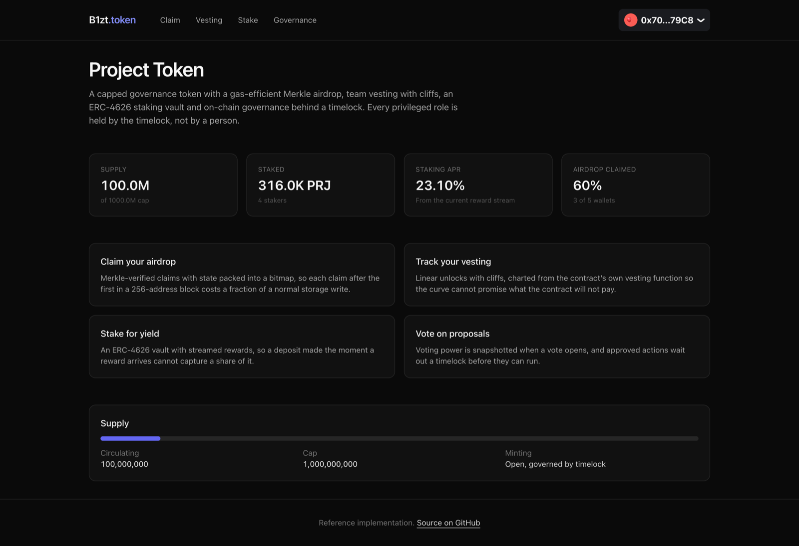
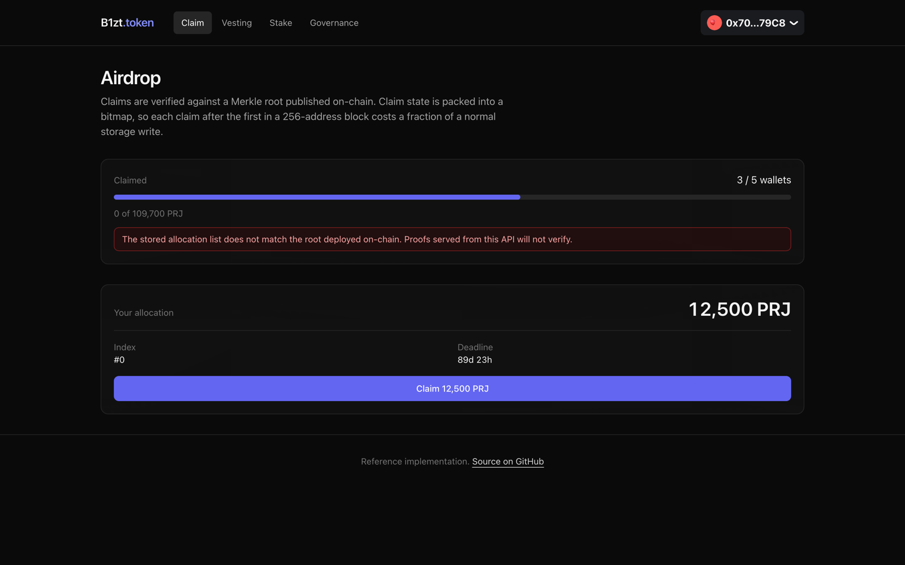
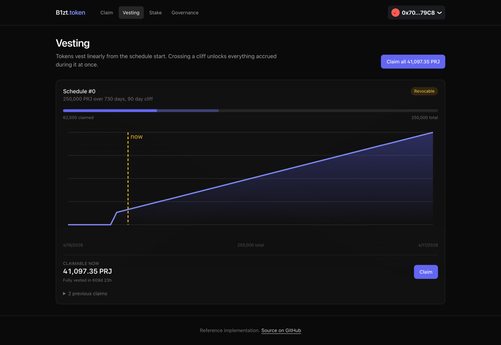
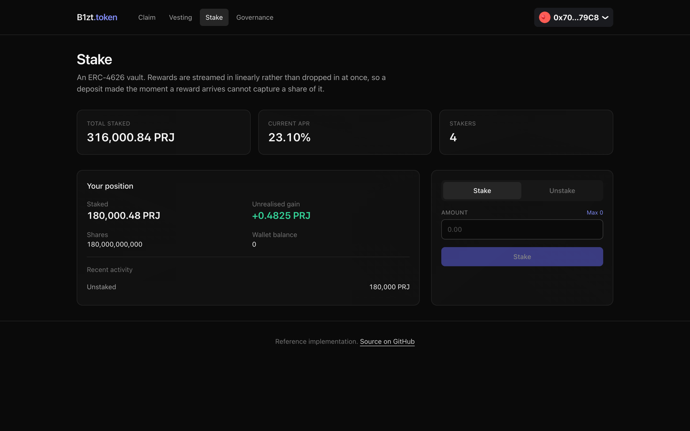
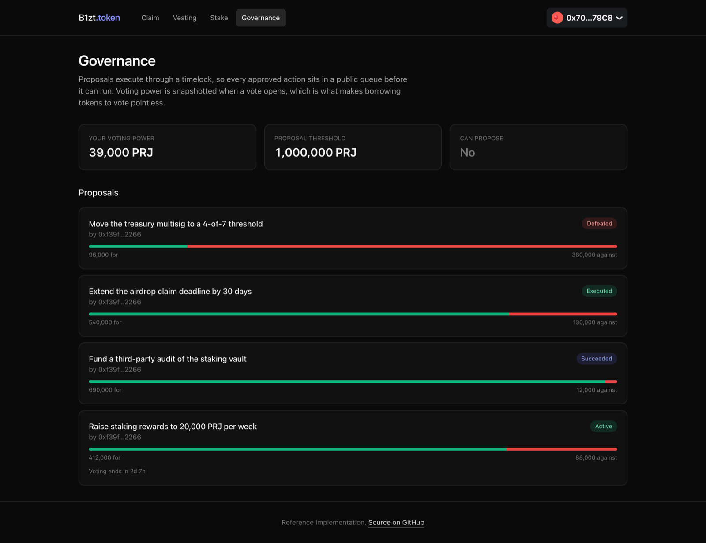

# Token Launch Suite

Everything a project needs on the day it launches a token: a capped supply, an airdrop people can
claim, team vesting with cliffs, a staking vault that pays rewards, and governance that decides what
happens next.

Solidity contracts, a TypeScript API that indexes the chain, and a Next.js frontend. The whole thing
runs on your laptop in about five minutes, with no testnet faucet and no API keys.



---

## What you can do with it

**Claim an airdrop.** Eligibility is proved with a Merkle proof rather than a list stored on chain,
so publishing an airdrop to 100,000 addresses costs one transaction. Claim state is packed into a
bitmap, which makes each claim after the first in a block of 256 addresses a fraction of the usual
storage cost.



**Watch team tokens unlock.** Grants vest linearly with an optional cliff. The chart is drawn from
the contract's own vesting function, so it cannot promise a curve the contract will not pay.



**Stake for yield.** An ERC-4626 vault where rewards are streamed in over time rather than dropped
in at once, so a deposit made the moment a reward arrives cannot capture a share of it.



**Vote on proposals.** Voting power is snapshotted when a vote opens, which is what makes borrowing
tokens to vote pointless. Anything that passes waits out a timelock before it can run, so holders
who disagree have time to react.



---

## Run it yourself

You will need [Docker](https://docs.docker.com/get-docker/), [Node 20+](https://nodejs.org),
[pnpm](https://pnpm.io/installation) and
[Foundry](https://book.getfoundry.sh/getting-started/installation).

### 1. Start Postgres and a local chain

```bash
docker compose up -d
```

Postgres lands on port 5433 and an Anvil node on 8545. Anvil is a local Ethereum chain: it mines on
a timer, hands out funded test accounts, and forgets everything when you stop it.

### 2. Deploy the contracts

```bash
cd contracts
forge install

export RPC=http://localhost:8545
export PRIVATE_KEY=0xac0974bec39a17e36ba4a6b4d238ff944bacb478cbed5efcae784d7bf4f2ff80

forge script script/Deploy.s.sol:Deploy --rpc-url $RPC --broadcast
```

That key is Anvil's first test account, published in Foundry's own documentation and worthless on
any real network. Never put a key holding real funds into a shell variable.

The script prints the deployed addresses ready to paste into your `.env` files, and then an
ownership check. The three deployer lines must read `false`, `false`, `true`: the deployer is no
longer a minter, no longer an admin, and the timelock now holds both. If they read anything else the
deployment left a privileged key behind.

### 3. Put some state on the chain

```bash
bash script/demo.sh
```

This distributes tokens, stakes from three wallets, funds the reward stream, creates three vesting
schedules in different states and delegates voting power. It uses Anvil's ability to impersonate the
timelock, which is the normal way to set up local state without waiting out a real governance vote.

### 4. Start the backend

```bash
cd ../backend
cp .env.example .env        # paste in the addresses from step 2
pnpm install
pnpm prisma db push         # create the tables
pnpm db:seed                # sample proposals, votes and claim history
pnpm dev
```

`pnpm db:seed` fills the tables the indexer would normally build from months of chain history, so
the governance page has proposals in every state rather than being correct and empty.

### 5. Start the frontend

```bash
cd ../frontend
cp .env.example .env.local  # paste in the NEXT_PUBLIC_ addresses from step 2
pnpm install
pnpm dev
```

Open <http://localhost:3000>. To connect a wallet, add the Anvil network to MetaMask (RPC
`http://localhost:8545`, chain id `31337`) and import the test key from step 2.

### If something does not work

| Symptom | Cause |
|---|---|
| Every page says "wrong network" | Your wallet is not on chain 31337. |
| Stats show `-` | The backend cannot reach Anvil, or the addresses in `.env` do not match what the deploy script printed. `curl localhost:4001/health` should return `{"status":"ok"}`. |
| Backend exits at startup | It validates its whole environment at boot and names the variable at fault. |
| Vesting and claim pages look empty | They are per-wallet. Connect the wallet the demo script granted tokens to. |

---

## Layout

```
contracts/
  src/ProjectToken.sol        Capped ERC-20 with Permit and Votes, timestamp clock
  src/MerkleDistributor.sol   Bitmap-packed airdrop claims
  src/TokenVesting.sol        Linear vesting with cliffs and revocation
  src/StakingVault.sol        ERC-4626 vault with a streamed reward schedule
  src/ProjectGovernor.sol     Governor over a TimelockController
  script/Deploy.s.sol         Deploys, wires, and hands control to the timelock
  script/demo.sh              Demo state for a local chain
  test/                       88 tests: unit, fuzz, invariants, inflation attack
backend/                      Indexes claims, vesting, stake positions and proposals
frontend/                     Claim, vesting dashboard, staking and governance
```

```bash
cd contracts && forge test              # 88 tests
cd contracts && FOUNDRY_PROFILE=deep forge test   # 10,000 fuzz runs
cd backend   && pnpm test               # 13 Merkle tests
```

Fuzz properties worth calling out:

- `testFuzz_capIsNeverExceeded` - no sequence of mints exceeds the cap
- `testFuzz_vestedIsMonotonicAndBounded` - vesting never decreases and never exceeds the grant
- `testFuzz_partialClaimsSumToGrant` - however a claim is split in time, the beneficiary receives exactly the grant
- `testFuzz_revocationConservesValue` - beneficiary plus owner always equals the grant
- `testFuzz_vaultIsAlwaysSolvent` - shares outstanding are always redeemable from assets held
- `testFuzz_roundTripNeverProfits` - deposit then immediately withdraw can never return more than went in
- `testFuzz_everyClaimantCanClaimOnce` - every airdrop index claims exactly once, in any order

---

## Security decisions

| Decision | Reason |
|---|---|
| Supply cap is `immutable` | An adjustable cap is not a cap. This is the most common rug vector |
| `finishMinting` is one-way | Stronger than revoking a role, which can simply be granted again |
| Minting is role-gated, not owner-gated | The role can go to an emissions contract without handing over every other admin power |
| Vesting is funded at creation | A schedule the contract cannot pay out is a promise, not a commitment |
| Revocation releases vested first | Otherwise an owner can time a revocation to confiscate earned tokens |
| `totalCommitted` bounds the sweep | The owner can never sweep tokens a beneficiary is still owed |
| Airdrop leaves bind the account | A proof cannot be redirected by whoever submits the transaction |
| Airdrop leaves are double hashed | Stops a 64-byte internal node being replayed as a leaf |
| `sweepOther` excludes the airdrop token | Otherwise it is a back door around the claim deadline |
| Reward stream excluded from `totalAssets` | Stops a same-block depositor capturing rewards they did not earn |
| `_decimalsOffset` of 6 | Makes the ERC-4626 inflation attack cost far more than it can return |
| Withdrawal cooldown capped at 30 days | An owner must not be able to lock stakers in indefinitely |
| Timelock owns everything | The delay is the only real protection a dissenting holder has |
| Deployer renounces all roles | Verified on-chain by the deploy script's ownership check |

One documented trade-off: the cap is checked against `totalSupply`, so burning tokens reopens
mintable headroom. The cap bounds circulating supply, not cumulative issuance.
`test_burn_doesNotIncreaseMintableHeadroom` asserts this explicitly rather than leaving it as a
surprise.

This code has not been audited. It is a reference implementation.

---

## License

MIT
