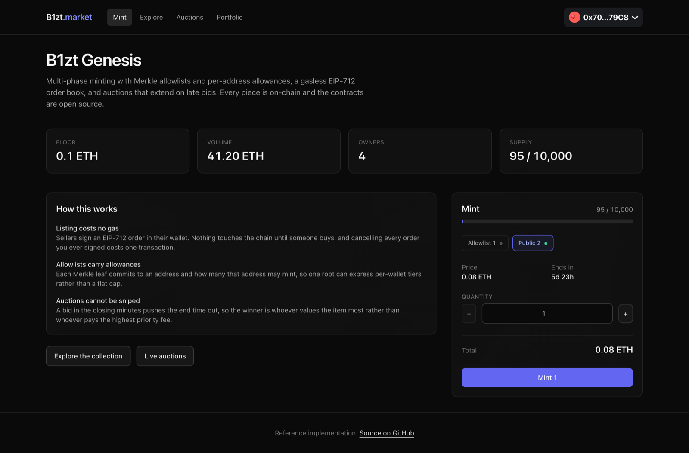
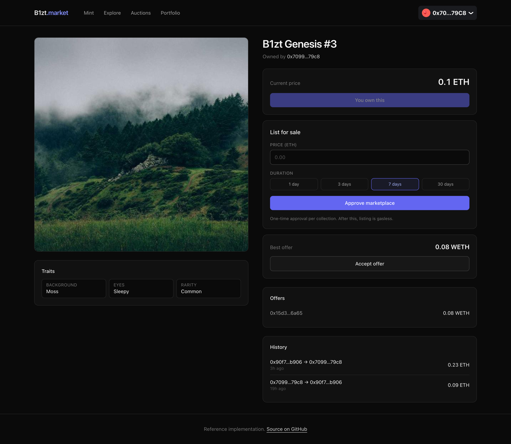
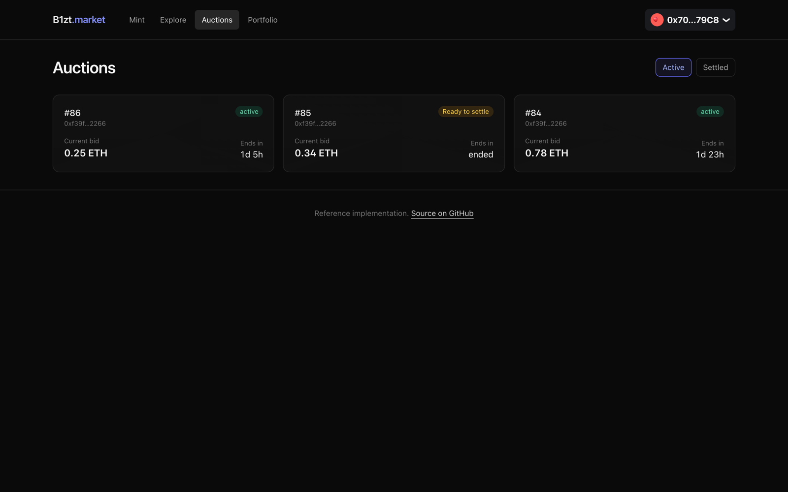

# NFT Collection and Marketplace

A complete NFT platform on Ethereum: a collection people can mint from, a marketplace where they can
trade what they minted, and auctions for the pieces worth bidding on.

Solidity contracts, a TypeScript API that indexes the chain, and a Next.js frontend. The whole thing
runs on your laptop in about five minutes, with no testnet faucet and no API keys.



---

## What you can do with it

**Mint from a collection.** Drops run in phases. An early phase can be gated by an allowlist where
every address has its own allowance, and a later one can be open to everybody. The page shows which
phase is live and how long is left.

**Buy and sell without paying gas to list.** A seller signs an order in their wallet, which costs
nothing. The order only touches the chain when a buyer fills it. Cancelling every order you have
ever signed takes a single transaction.

**Bid in auctions that cannot be sniped.** A bid in the closing minutes pushes the end time out, so
the winner is whoever values the item most rather than whoever pays the highest priority fee.

**Browse by trait.** The collection page builds its filter panel from the metadata it has loaded,
with a count for every trait value.


Every item has its own page with the current price, the offers sitting below it, and the sale
history.





A wallet's portfolio shows its holdings, its open listings, and one button that invalidates every
order it has ever signed.


---

## Run it yourself

You will need [Docker](https://docs.docker.com/get-docker/), [Node 20+](https://nodejs.org),
[pnpm](https://pnpm.io/installation) and
[Foundry](https://book.getfoundry.sh/getting-started/installation).

### 1. Start Postgres and a local chain

```bash
docker compose up -d
```

This gives you Postgres on port 5432 and an Anvil node on 8546. Anvil is a local Ethereum chain: it
mines on a timer, hands out test accounts with plenty of ETH, and forgets everything when you stop
it. No faucet, no waiting for testnet blocks.

### 2. Deploy the contracts

```bash
cd contracts
forge install

export RPC=http://localhost:8546
export PRIVATE_KEY=0xac0974bec39a17e36ba4a6b4d238ff944bacb478cbed5efcae784d7bf4f2ff80

forge script script/Deploy.s.sol:Deploy --rpc-url $RPC --broadcast
```

That key is Anvil's first test account. It is printed in Foundry's own documentation and is
worthless on any real network. Never put a key that holds real funds into a shell variable.

The script prints the deployed addresses ready to paste into your `.env` files. Keep the output.

### 3. Put some state on the chain

```bash
export COLLECTION_ADDRESS=<from step 2>
export AUCTION_ADDRESS=<from step 2>

forge script script/Demo.s.sol:Demo --rpc-url $RPC --broadcast
```

This mints 95 NFTs across four wallets, opens two mint phases, reveals the metadata and starts an
auction. Run it against a fresh chain; it is not written to be applied twice.

### 4. Start the backend

```bash
cd ../backend
cp .env.example .env        # paste in the addresses from step 2
pnpm install
pnpm prisma db push         # create the tables
pnpm db:seed                # sample listings, offers and sale history
pnpm dev
```

`pnpm db:seed` exists because listings and offers are signed off-chain and only reach the chain when
somebody fills them. Without it every page would be correct and empty, which tells you nothing about
whether the app works.

### 5. Start the frontend

```bash
cd ../frontend
cp .env.example .env.local  # paste in the NEXT_PUBLIC_ addresses from step 2
pnpm install
pnpm dev
```

Open <http://localhost:3000>. To connect a wallet, add the Anvil network to MetaMask (RPC
`http://localhost:8546`, chain id `31337`) and import the test key from step 2.

### If something does not work

| Symptom | Cause |
|---|---|
| Every page says "wrong network" | Your wallet is not on chain 31337. |
| Numbers are all zero or `-` | The backend cannot reach Anvil, or the addresses in `.env` do not match what the deploy script printed. `curl localhost:4000/health` should return `{"status":"ok"}`. |
| Backend exits at startup | It validates its whole environment at boot and names the variable at fault. The error message is the fix. |
| Frontend shows an empty collection | You skipped `pnpm db:seed`, or the collection address in `.env.local` is not the one you deployed. |

---

## Layout

```
contracts/                    Solidity, built and tested with Foundry
  src/Collection721.sol       ERC-721A with phased minting and delayed reveal
  src/Editions1155.sol        ERC-1155 editions
  src/Marketplace.sol         EIP-712 signed order book
  src/EnglishAuction.sol      Auctions with anti-snipe extension
  src/PaymentSettler.sol      Shared fee and royalty splitting
  script/Deploy.s.sol         Deployment
  script/Demo.s.sol           Demo state for a local chain
  test/                       130 tests
backend/                      Fastify + Prisma + Postgres
  src/indexer/                Chain events into the database
  src/orders/                 Order validation and the order book
  src/merkle/                 Allowlist trees and proofs
  prisma/seed.ts              Sample data
frontend/                     Next.js App Router, wagmi + RainbowKit
```

```bash
cd contracts && forge test    # 130 contract tests
cd backend   && pnpm test     # 10 Merkle and order validation tests
```

---

## Decisions worth explaining

The parts that take real work to get right, each covered by a test that would fail if it were done
the naive way.

**Listing is a signature, not a transaction.** An order is an EIP-712 struct the seller signs.
Creating one costs nothing, and cancelling every order a maker has ever signed is a single nonce
bump. The trade-off is that an order can go stale, so the API revalidates ownership and approval
before serving it.

**Merkle leaves carry per-address allowances.** A leaf commits to `(address, allowance)` rather than
to an address alone, so one root expresses per-wallet tiers instead of a flat cap. Leaves are double
hashed, which is what stops a 64-byte internal node being replayed as a leaf to forge membership.

**The off-chain tree and the on-chain verifier are pinned to each other.** Both build from the same
fixed entry set and assert the same root, in
[`MerkleCrossCheck.t.sol`](contracts/test/MerkleCrossCheck.t.sol) and
[`tree.test.ts`](backend/src/merkle/tree.test.ts). Without this a mismatch fails silently: the API
serves well-formed proofs and every mint reverts with the same unhelpful error.

**Hostile collections cannot break settlement.** `royaltyInfo` is a call into an untrusted contract.
It may revert, return nonsense, or claim a 90% royalty and drain the seller. The call is wrapped, the
interface probed first, and the result capped at 10%. Tested against a `GreedyRoyaltyCollection` and
a `RevertingRoyaltyCollection`.

**Payouts cannot brick a trade.** A recipient that rejects ETH would otherwise make every sale
involving them permanently unfillable. A failed native push becomes a withdrawable credit instead,
with the forwarded gas capped so a recipient cannot grief settlement by burning it.

**The indexer survives reorgs.** Its cursor sits at the highest *finalised* block. Everything above
that is deleted and re-scanned each pass, and every row is keyed on `(txHash, logIndex)`, so a reorg
cannot leave a phantom sale behind. Indexers that track the chain head instead get this wrong.

**Auctions escrow the asset.** The NFT moves into the auction contract, so a seller cannot sell it
elsewhere while bids are live.

---

## What is not here

Nothing here has been audited. It is a reference implementation, written to be read.

Off-chain order storage is a single Postgres instance. A real marketplace would replicate it,
because losing it loses every unfilled order.
